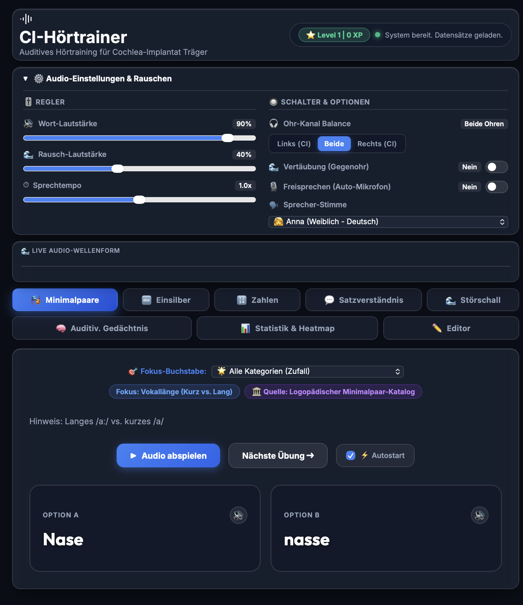
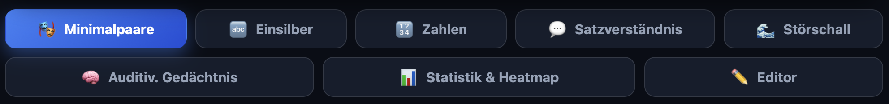
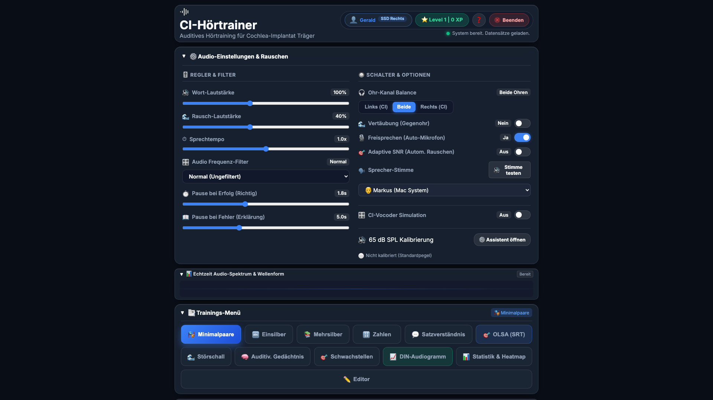
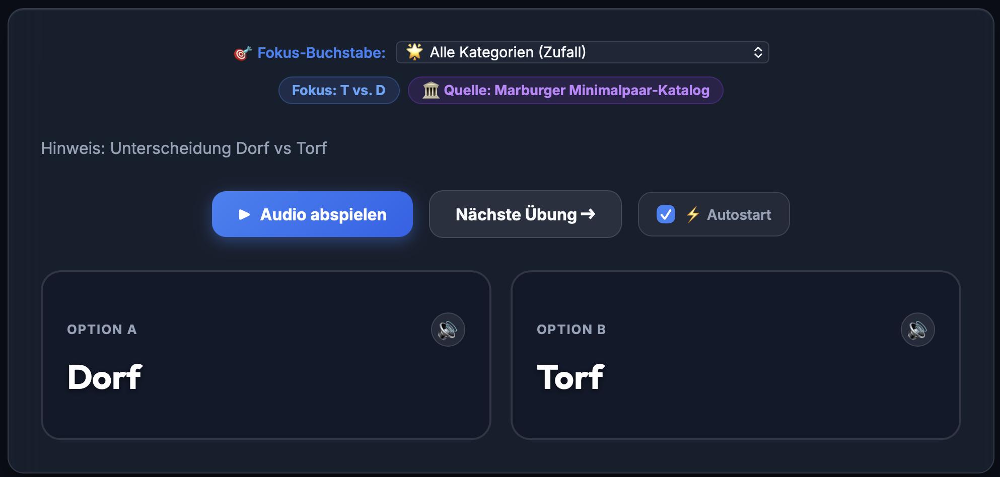

# CI-Hörtrainer – Benutzerhandbuch

Willkommen beim **CI-Hörtrainer**, der spezialisierten Anwendung für das auditive Hörtraining von Cochlea-Implantat (CI) Trägern und Hörgeräteträgern.

---

## 🖥️ 1. Benutzeroberfläche & Dashboard



Das Dashboard bietet eine übersichtliche, dunkle Benutzeroberfläche mit Schnellzugriff auf alle Funktionen:

1. **Kopfzeile & XP-Gamification**:
   - **Level & Erfahrungspunkte**: Zeigt den aktuellen Trainingsfortschritt (z. B. `Level 1 | 20 XP`).
   - **Status-Anzeige**: Zeigt das aktuell aktive Modul an (z. B. `► Spiele Minimalpaare...`).
2. **Einklappbare Audio-Einstellungen**: Stufenlose Konfiguration der Audioausgabe und des Störschalls.
3. **Live Audio-Wellenform**: Visualisiert das abgespielte Sprach- und Rauschsignal in Echtzeit.
4. **Modul-Navigationsleiste**: Schneller Wechsel zwischen den 8 Trainingsbereichen.

---

## 🧩 2. Modul-Navigationsleiste



Über die obere Navigationsleiste greifst du auf die einzelnen Trainingsmodule zu:

| Icon | Modul | Funktionsbeschreibung |
| :--- | :--- | :--- |
| 🎭 | **Minimalpaare** | Unterscheidung phonetisch ähnlicher Wortpaare (z. B. *P vs. B*, *N vs. NG*, *Vokallänge*). |
| 🔤 | **Einsilber** | Freiburger Einsilber-Test (DIN 45621) mit phonetischer Auswertung (Anlaut/Vokal/Auslaut). |
| 🔢 | **Zahlen** | Audiometrischer Test für Zahlen, zweistellige Uhrzeiten (*14:30 Uhr*) & Geldbeträge (*12,50 €*). |
| 💬 | **Satzverständnis** | OLSA-Satzverständnis mit **Wort-Fokus (Multiple Choice)** und **Ganzsatz-Diktat (Freie Eingabe/Spracheingabe)**. |
| 🎯 | **Schwachstellen** | Adaptives Training für Ihre fehlerintensivsten Phonem-Kategorien (< 60% Genauigkeit). |
| 🌊 | **Störschall** | Hören unter erschwerten Alltagsbedingungen (Café, Verkehr) mit **separatem Störschall-Regler**. |
| 🧠 | **Auditiv. Gedächtnis** | Schulung der Merkspanne durch Wiederholen von Sequenzen aus 2 bis 6 Wörtern. |
| 📊 | **Statistik & Heatmap** | Detaillierte Auswertung von Trefferquoten, Reaktionszeiten und phonetischen Fehlermustern. |
| ✏️ | **Editor** | Eigener Katalog-Editor zum Hinzufügen oder Anpassen von Übungssätzen und Wortpaaren. |

---

## 🎧 3. Audio-Einstellungen & Rauschen



Das Bedienfeld **Audio-Einstellungen & Rauschen** erlaubt eine gezielte Anpassung an individuelle Hörbedürfnisse:

### 🎚️ Regler (Lautstärke & Tempo)
* **Wort-Lautstärke (0% – 250%)**: Stellt die Lautstärke der Sprachausgabe stufenlos ein.
* **Rausch-Lautstärke (0% – 100%)**: Regelt die Intensität des beigemischten Störgeräuschs stotterfrei ohne Audio-Unterbrechungen.
* **🔊 Separate Störschall-Lautstärke**: Direkt im Störschall-Tab konfigurierbarer Lautstärkeregler für Hintergrundgeräusche.
* **Sprechtempo (0.6x – 1.4x)**: Passt die Wiedergabegeschwindigkeit stufenlos an, ohne die Tonhöhe zu verändern.

### 🔘 Schalter & Optionen
* **🎯 Adaptive SNR (Autom. Rauschen)**: Automatisches Störschall-Stufenverfahren (+5% Lärm nach 3 richtigen Antworten / -5% bei Fehler).
* **Ohr-Kanal Balance (Stereo-Isolierung)**:
  * `Links (CI)`: Gibt das Audiosignal ausschließlich auf dem linken Kanal aus.
  * `Beide`: Ausgewogene Stereo-Wiedergabe auf beiden Ohren.
  * `Rechts (CI)`: Gibt das Audiosignal ausschließlich auf dem rechten Kanal aus.
* **Vertäubung (Gegenohr)**: Sendet kontinuierliches Rauschen auf das Nicht-Testohr, um ein ungewolltes Mittestesten zu verhindern.
* **Freisprechen (Auto-Mikrofon)**: Aktiviert die automatische Spracheingabe per Mikrofon für direkt gesprochene Antworten.
* **Sprecher-Stimme**: Auswahl der Text-to-Speech-Stimme (z. B. *Anna (Weiblich - Deutsch)*).

---

## 🎯 4. Übungsablauf (am Beispiel Minimalpaare)



### Komponenten der Übungskarte:
1. **Fokus-Buchstabe (Filter)**: Über das Dropdown-Menü wählst du gezielt die zu trainierende Lautdifferenzierung aus (z. B. *N vs. NG (Zungenspitzen- vs. Gaumen-Nasal)*).
2. **Kategorie & Quelle**: Zeigt wissenschaftliche Quellen und Logos an (z. B. *Logopädischer Minimalpaar-Katalog*).
3. **Phonetischer Hinweis**: Erklärt das spezifische Hörziel (z. B. *Hinweis: Inlautdifferenzierung -nn- vs. -ng- bei kurzem /i/*).
4. **Wiedergabesteuerung**:
   * **`▶ Audio abspielen`**: Spielt das Zielwort akustisch ab.
   * **`Nächste Übung ➔`**: Lädt die nächste Aufgabe.
   * **`⚡ Autostart`**: Wenn aktiviert, wird beim Aufrufen der nächsten Übung das Audio automatisch abgespielt.
5. **Antwortkarten (Option A vs. Option B)**:
   * Klicke auf die Karte mit dem gehörten Wort (z. B. *Rinne* vs. *Ringe*).
   * Nach der Auswahl erhältst du sofortiges visuelles und akustisches Feedback.

---

## 🚀 5. Anwendung starten

```bash
# Web-Interface & Desktop-App starten
python3 main.py
```
Öffne anschließend deinen Browser unter: `http://localhost:8080` (falls sich das App-Fenster nicht automatisch öffnet).
