# CI-Hörtrainer – Benutzerhandbuch

Willkommen beim **CI-Hörtrainer**, der spezialisierten Software für das auditive Hörtraining, die Sprach-Diskrimination und die audiometrische Selbstevaluation von Cochlea-Implantat (CI) Trägern und Hörgeräteträgern.

---

## 🚀 1. Schnellstart & Systemstart

### 1.1 Starten der Anwendung

* **macOS:** Doppelklick auf `start_ci_trainer.command` oder im Terminal:
  ```bash
  ./start_ci_trainer.sh
  ```
* **Windows:** Doppelklick auf `start_ci_trainer_win.bat`.
* **Linux:** Im Terminal:
  ```bash
  ./start_ci_trainer.sh
  ```

> [!NOTE]
> Die Anwendung prüft beim Start automatisch, ob alle Abhängigkeiten und Python vorhanden sind, und öffnet die Weboberfläche selbstständig unter `http://localhost:8080`.


---

## 👤 2. Profilverwaltung & CI-Versorgung

Über den oberen Profil-Button `[ 👤 <Name> | <Versorgung> ▾ ]` in der Kopfleiste oder über den Hotkey <kbd>Alt+P</kbd> (macOS: <kbd>⌥P</kbd>) bzw. <kbd>U</kbd> öffnest du den **Profil-Manager**.

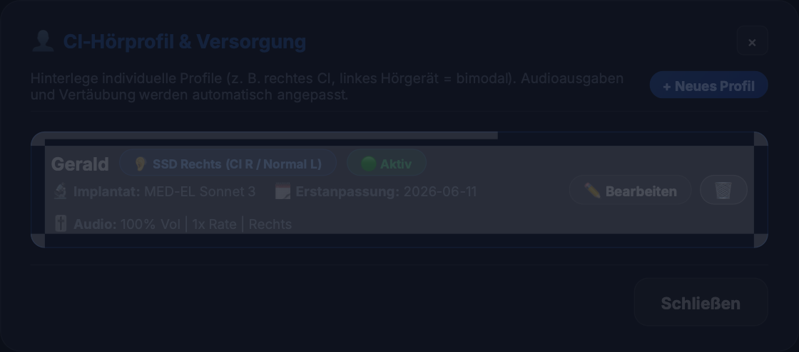

### 2.1 Konfiguration der Hörversorgung

1. **Versorgungstyp:**
   * 🦻 **Monoral Links / Rechts:** Fokussiert das Training auf das jeweilige Implantat-Ohr.
   * 🦻🦻 **Bilateral:** Gleichzeitige oder abwechselnde Stimulation beider CI-Seiten.
   * 🦻 **Bimodal Links / Rechts:** Kombination aus CI auf der einen und Hörgerät (HG) auf der anderen Seite.
   * 🦻 **SSD Links / Rechts (Single Sided Deafness):** Einseitige Taubheit / CI mit normalhörendem Gegenohr inklusive automatischer Vertäubungsunterstützung.

2. **Prozessor- & Fabrikatauswahl:**
   * Auswahl des spezifischen Soundprozessors (z. B. *Cochlear Nucleus 8/7, Kanso 2, MED-EL Sonnet 3/2, Rondo 3, Advanced Bionics Naída CI Marvel, Sky CI, Oticon Neuro 2*).

3. **Erstanpassungsdatum:**
   * Speicherung des Datums der Erstanpassung zur Dokumentation des individuellen Hörerfolgs über die Zeit.

4. **Automatische Profil-Synchronisation:**
   * Sämtliche Regler und Einstellungen (Lautstärke, Rauschen, Sprechtempo, Stimme, Stereo-Balance, Autostart-Verzögerung) werden **in Echtzeit im aktiven Profil gespeichert** – ohne manuelles Speichern.

---

## 🎧 3. Audio-Einstellungen, Kalibrierung & CI-Simulation

Das einklappbare Bedienfeld **„⚙️ Audio-Einstellungen & Rauschen"** erlaubt die exakte Anpassung an deine akustischen Bedürfnisse.


### 3.1 Lautstärke & Sprechtempo

* **Wort-Lautstärke (0 % – 250 %):** Stufenlose Verstärkung der Sprachausgabe.
* **Sprechtempo (0.6x – 1.4x):** Verlangsamt oder beschleunigt das Sprechen ohne Tonhöhenverzerrung.

### 3.2 Stereo-Kanalbalance & Vertäubung

* **Kanal-Balance:** Regelt, auf welchem Ohr die Sprachausgabe erfolgt (`Links (CI)`, `Beide`, `Rechts (CI)`).
* **Vertäubung (Gegenohr):** Sendet kontinuierliches Maskierungsrauschen auf das Nicht-Testohr, um ein unerwünschtes Mithören (Überhören) zu verhindern.
* **Freisprechen (Auto-Mikrofon):** Startet bei jeder neuen Aufgabe automatisch die Spracherkennung zum Nachsprechen, nachdem die Audioausgabe abgeschlossen ist.

### 3.3 🔊 65 dB SPL Lautstärke-Kalibrierungs-Assistent

Für standardisierte Hörergebnisse nach DIN-Norm kannst du die Lautstärke kalibrieren:

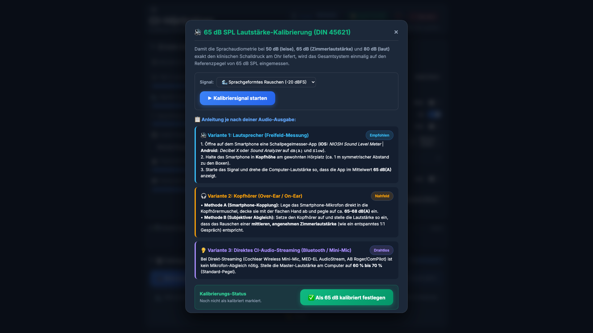

1. Öffne den Assistenten über den Button **„🔊 65 dB Kalibrierung"**.
2. Wähle dein Setup aus:
   * **Lautsprecher (Freifeld):** 1 Meter Abstand mit Smartphone-Pegelmesser-App (A-Bewertung, *Fast*).
   * **Over-Ear Kopfhörer:** Testsignal am Hörer anliegend.
   * **Direct-Audio-Streaming (Bluetooth / Roger Pen):** Einstellen auf 60–70 % des Systempegels.
3. Starte das **CCITT-Sprachsimulationsrauschen** oder den **1 kHz Sinuston (-20 dBFS)** und passe deine Systemlautstärke an, bis exakt 65 dB(A) erreicht sind.

### 3.4 🎛️ CI-Vocoder Simulation (Greenwood-Filterbank)

Der CI-Vocoder zerlegt das Sprachsignal in frequenzselektive Cochlea-Kanäle und resynthetisiert sie als reine Sinustöne:

* **Hersteller-Kanalprofile:**
  * `Cochlear Nucleus` (22 Kanäle)
  * `Advanced Bionics HiRes` (16 Kanäle)
  * `MED-EL Synchrony` (12 Kanäle)
  * `Hörtraining Fokus` (8 Kanäle)
  * `Extrem verarmt` (4 Kanäle)
* **Didaktischer Nutzen:** Ermöglicht Normalhörenden, Therapeuten und Angehörigen das Nachempfinden des elektrischen Hörens und trainiert das Gehirn auf das Erkennen spektral reduzierter Signale.

---

## 🌐 4. Sprecher-Stimmen: Microsoft Azure Neural & System-Stimmen

Der CI-Hörtrainer unterstützt drei Stimmkategorien – auswählbar im Dropdown **„Sprecher-Stimme"** der Audio-Einstellungen:

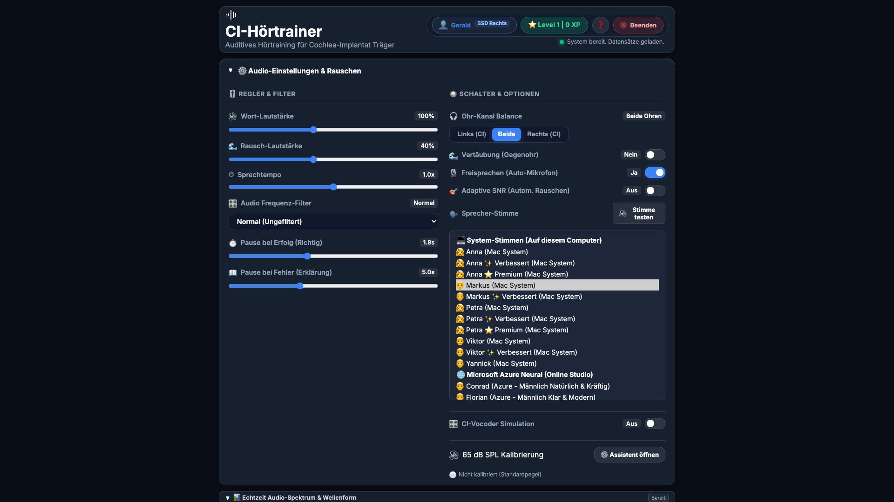

### 4.1 🇩🇪 Microsoft Azure Neural Studio-Stimmen (Online · 48 kHz · Freeware)

Hochwertigste Sprachqualität durch Microsoft Azure Neural Network-Synthese. Kein API-Key erforderlich.

#### 🇩🇪 Deutschland

| Stimme | Geschlecht | Charakter | Empfehlung |
|:---|:---|:---|:---|
| **Conrad** | 👨 Männlich | Natürlich & kräftig | ★ Standard-Empfehlung Männer |
| **Florian** | 👨 Männlich | Klar & modern | Präzise Konsonanten |
| **Killian** | 👨 Männlich | Dynamisch & lebendig | Frequenzbereich-Training |
| **Katja** | 👩 Weiblich | Klar & prägnant | ★ Standard-Empfehlung Frauen |
| **Amala** | 👩 Weiblich | Sanft & natürlich | Einstiegstraining |
| **Seraphina** | 👩 Weiblich | Fein & ausgewogen | Fortgeschrittene |

#### 🇦🇹 Österreich (Regionale Akzentvariation)

| Stimme | Geschlecht | Charakter |
|:---|:---|:---|
| **Jonas** | 👨 Männlich | Österreichisch, natürlich |
| **Ingrid** | 👩 Weiblich | Österreichisch, warm |

#### 🇨🇭 Schweiz (Regionale Akzentvariation)

| Stimme | Geschlecht | Charakter |
|:---|:---|:---|
| **Jan** | 👨 Männlich | Schweizerdeutsch, klar |
| **Leni** | 👩 Weiblich | Schweizerdeutsch, natürlich |

> [!TIP]
> Verwende die **österreichischen und Schweizer Stimmen** für gezieltes Training der Toleranz gegenüber regionalen Akzentvariationen – eine wichtige Alltagskompetenz für CI-Träger.

### 4.3 🇬🇧/🇺🇸 English Azure Neural & System Voices (Bilingual Training)

Beim Umschalten auf die englische Übungssprache (Header `🇬🇧 EN`) stehen dedicated US- und UK-Sprecher zur Verfügung:

| Stimme | Land | Geschlecht | Typ |
|:---|:---|:---|:---|
| **Ava** | 🇺🇸 US | 👩 Weiblich | Microsoft Azure Neural Studio |
| **Andrew** | 🇺🇸 US | 👨 Männlich | Microsoft Azure Neural Studio |
| **Sonia** | 🇬🇧 UK | 👩 Weiblich | Microsoft Azure Neural Studio |
| **Ryan** | 🇬🇧 UK | 👨 Männlich | Microsoft Azure Neural Studio |
| **Samantha / Alex / Zira / David** | 🇺🇸 US / 🇬🇧 UK | Nativ | macOS / Windows Systemstimmen |

### 4.2 💻 Dynamisch erkannte macOS-Systemstimmen (Offline · Nativ · Latenzfrei)

Auf **macOS** erkennt die App automatisch alle heruntergeladenen deutschen Premium-Stimmen:

| Stimme | Typ | Qualität |
|:---|:---|:---|
| **Anna** | Weiblich | Standard / Premium (empfohlen) |
| **Yannick** | Männlich | Standard / Premium |
| **Petra** | Weiblich | Verbessert / Premium |
| **Markus** | Männlich | Verbessert / Premium |
| **Viktor** | Männlich | Verbessert |

> [!NOTE]
> **Stimmen herunterladen (macOS):** Systemeinstellungen → Bedienungshilfen → Gesprochene Inhalte → Systemstimme → Anpassen... → „Deutsch (Deutschland)" → Premium-Stimmen mit ⬇️ herunterladen.

Veraltete 80er-Jahre Synthesizer-Stimmen (*Bruno, Markus Classic, Anna Classic* etc.) werden automatisch herausgefiltert.

### 4.3 💻 Dynamisch erkannte Windows-Systemstimmen (Offline · Nativ)

Auf **Windows 10/11** erkennt die App automatisch installierte Sprachpakete:

| Stimme | Typ | Verfügbarkeit |
|:---|:---|:---|
| **Katja** | Weiblich | Windows 10/11 OneCore |
| **Conrad** | Männlich | Windows 11 (OneCore) |
| **Hedda** | Weiblich | SAPI5 Desktop |
| **Stefan** | Männlich | SAPI5 Desktop |

### 4.4 🔊 Stimme direkt vorhören

Klicke den Button **`🔊 Stimme testen`** direkt neben dem Stimmen-Dropdown, um sofort einen Testsatz mit der ausgewählten Stimme zu hören – vor dem Training.

---

## 🧩 5. Die 12 Trainings- und Analyse-Module


---

### Modul 1 – 🎭 Minimalpaare (<kbd>Alt+1</kbd>)

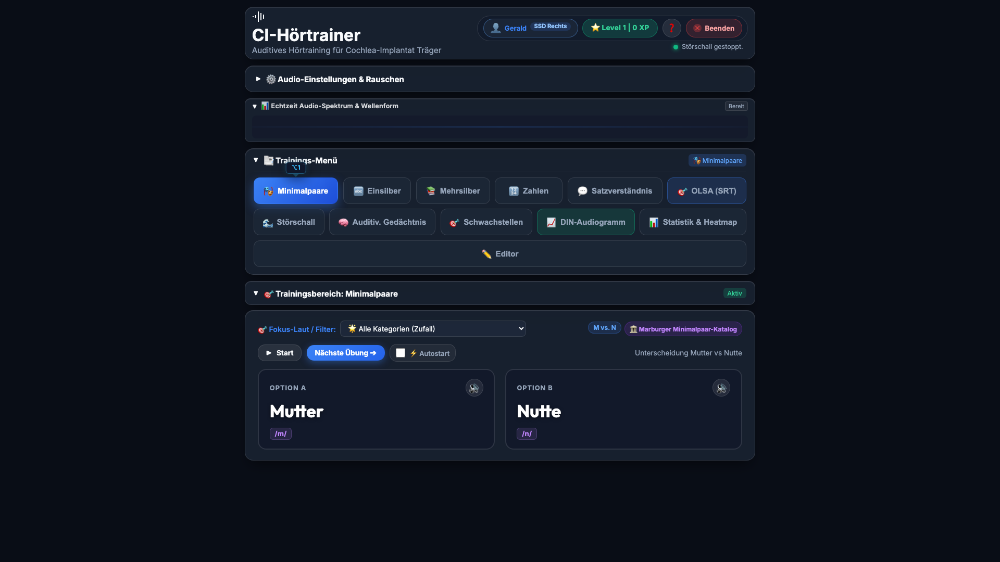

* **Ziel:** Feinste Lautdifferenzierung phonetisch ähnlicher Wörter (109 Kontrastgruppen).
* **Beispiele:** *Pass vs. Bass · Tasse vs. Dasse · Kamm vs. Gramm · Rinne vs. Ringe · See vs. Zeh · Matte vs. Matte*
* **Bedienung:**
  1. Drücke <kbd>Leertaste</kbd> oder klicke **▶ Abspielen** – das Wort wird vorgelesen.
  2. Wähle die richtige Option per Klick oder Tasten <kbd>1</kbd> / <kbd>2</kbd>.
  3. Detailliertes Feedback mit IPA-Lautschrift, Artikulationsort und Klangkategorie.
* **Kategorie-Filter:** Gezieltes Training von Plosiven, Frikativen, Nasalen oder Vokallängen-Kontrasten.
* **Auto-Mic:** Laut nachsprechen und die Spracherkennung überprüft deine Aussprache automatisch.

---

### Modul 2 – 🔤 Freiburger Einsilber – DIN 45621 (<kbd>Alt+2</kbd>)

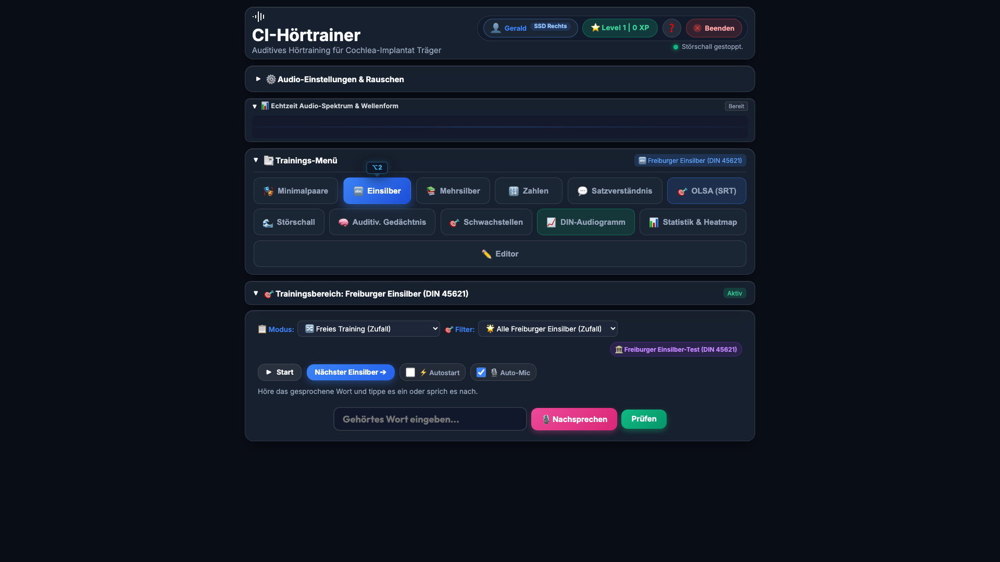

* **Ziel:** Standardisiertes Hörtraining nach dem **Freiburger Einsilber-Test (DIN 45621)** mit 20 offiziellen Testlisten à 20 Wörtern (400 Wörter gesamt).
* **Prüfmodus:** 20-Wort-Testdurchläufe mit abschließendem Prozent-Score und Detailauswertung.
* **Phonetische Auswertung:** Analyse von **Anlaut**, **Vokal** und **Auslaut** mit direktem Feedback zu Verwechslungsmustern (Kölner Phonetik Algorithmus).
* **Automatisches Mikrofon:** Nach dem Vorlesen jedes Wortes startet die Spracherkennung automatisch (sofern Auto-Mic aktiv).

---

### Modul 3 – 📚 Mehrsilber & Komposita (<kbd>Alt+M</kbd>)

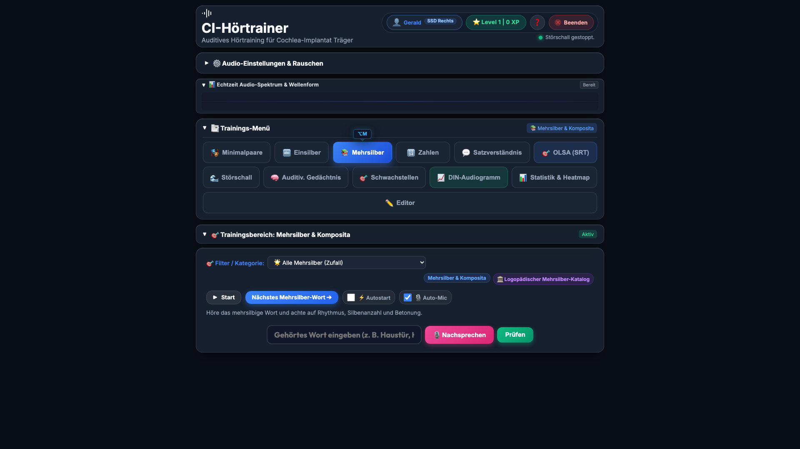

* **Ziel:** Erkennung von Silbenanzahl, Wortrhythmus und Betonungsmustern bei 2-, 3- und 4-silbigen Wörtern und zusammengesetzten Substantiven.
* **Visuelle Silbenanalyse:** Direkte Anzeige von Trennung und Silbenzahl:
  * *Haus·tür* (2 Silben)
  * *Wör·ter·buch* (3 Silben)
  * *Kin·der·gar·ten* (4 Silben)
  * *Stra·ßen·bahn·hal·te·stel·le* (7 Silben)
* **Kategorie-Filter:** Gezielte Auswahl von 2-, 3- oder 4-silbigen Wortkörpern.
* **Auto-Mic:** Nach dem Vorlesen des Kompositums startet das Mikrofon automatisch – mit intelligenter Wartezeit, die auch bei langen Wörtern korrekt abgewartet wird.

---

### Modul 4 – 🔢 Zahlen, Uhrzeiten & Beträge (<kbd>Alt+3</kbd>)

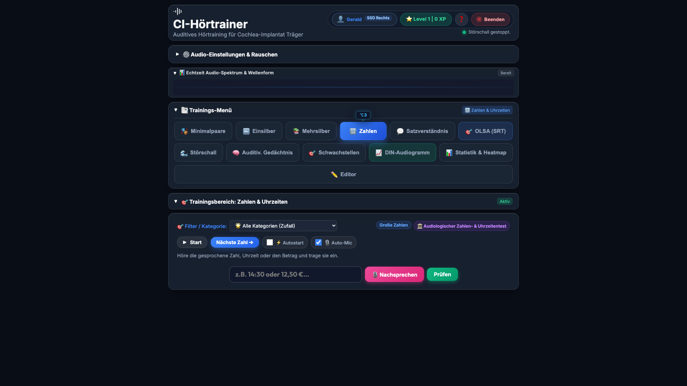

* **Ziel:** 10 standardisierte **DIN 45621 Freiburger Zahlenlisten** (100 zweisilbige Zahlen) sowie Uhrzeitangaben und Geldbeträge.
* **Ziffernkomposita-Parser:** Akzeptiert Ziffern (*„25"*) und Zahlwörter (*„fünfundzwanzig"*) gleichermaßen.
* **Testmodi:**
  * Einzel-Zahlen (2-stellig)
  * Größere Zahlen (3–5-stellig)
  * Uhrzeiten (*14:30 Uhr*)
  * Geldbeträge (*12,50 €*)

---

### Modul 5 – 💬 Satzverständnis & Diktat (<kbd>Alt+4</kbd>)

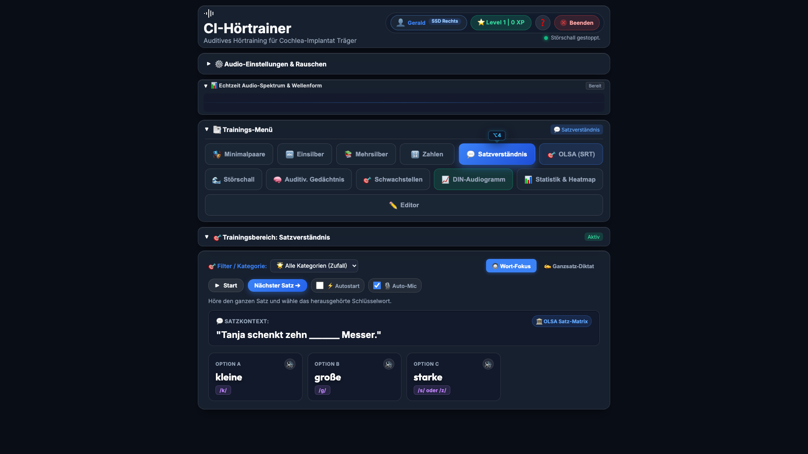

* **Zwei Trainingsmodi:**
  1. **Wort-Fokus (Multiple Choice):** Höre den Satz und identifiziere das fehlende Schlüsselwort aus 4 Alternativen.
  2. **Ganzsatz-Diktat (Freitext / Spracheingabe):** Höre den gesamten Satz und tippe oder sprich ihn nach. Wortweise Auswertung mit farbigen Badges (Grün = richtig, Rot = abweichend).
* **500 Alltagssätze** aus verschiedenen Kontexten (Alltag, Einkauf, Reise, Gesundheit).

---

### Modul 6 – 🎯 OLSA Adaptiver Satztest (<kbd>Alt+O</kbd>)

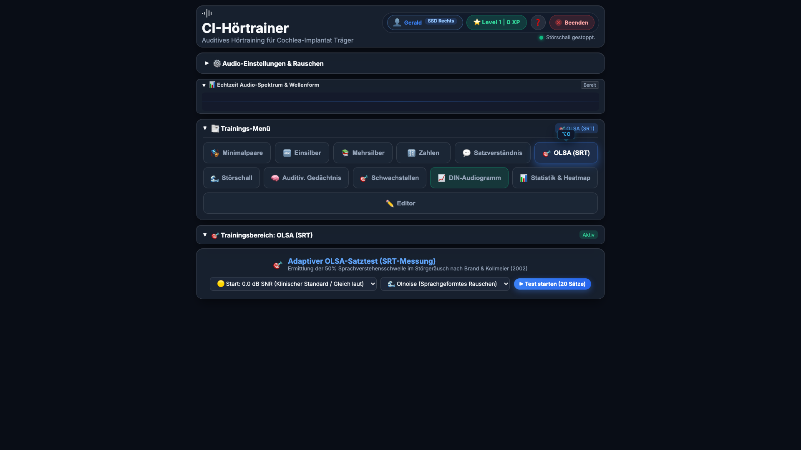

* **Ziel:** Bestimmung der 50 % Sprachverstehensschwelle im Störgeräusch (**SRT in dB SNR**) nach dem Oldenburger Satztest (Brand & Kollmeier 2002).
* **Ablauf:**
  1. 5-Wort-Matrixsätze (*Name + Verb + Zahl + Adjektiv + Nomen* aus 100.000 Kombinationen).
  2. Klicke die verstandenen Wörter in den 5 Spalten an.
  3. Das System passt den SNR-Pegel adaptiv an (±4 dB nach jeder Antwort).
  4. Live-Treppenplot auf Canvas mit Wendepunkten (Reversals) und Standardabweichung.

---

### Modul 7 – 🌊 Störschall-Training (<kbd>Alt+5</kbd>)

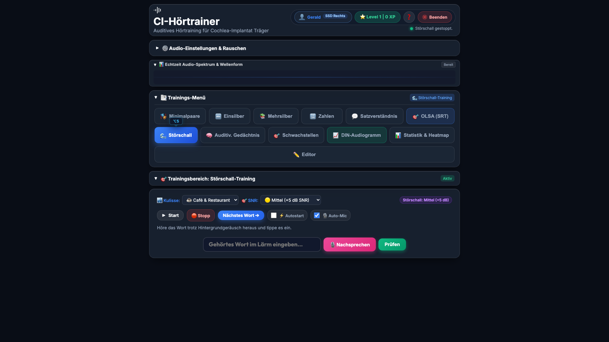

* **Ziel:** Sprachverstehen unter realistischen Alltagsbedingungen.
* **Lärmumgebungen:**
  * 🍽️ Cafeteria / Restaurant-Lärm
  * 🚗 Straßenverkehr
  * 🎉 Party / Viele Stimmen
* **Klinische SNR-Stufen:**
  * `+10 dB SNR` – Sehr leicht / Einstieg
  * `+5 dB SNR` – Leicht
  * `0 dB SNR` – Klinischer Standard
  * `-5 dB SNR` – Fortgeschritten / Anspruchsvoll
* **Unterbrechungsfreies Audio:** Der Störschall läuft kontinuierlich weiter, wenn du SNR oder Lautstärke anpasst.

---

### Modul 8 – 🧠 Auditives Gedächtnis (<kbd>Alt+6</kbd>)

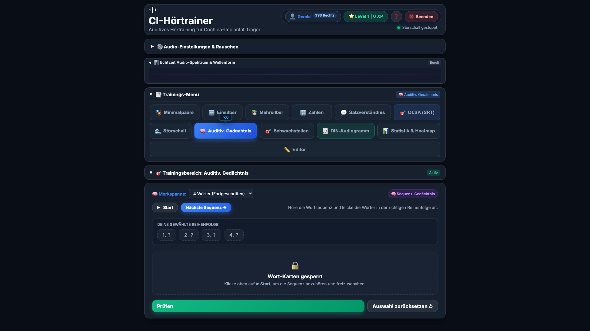

* **Ziel:** Erweiterung der auditiven Merkspanne und des Arbeitsgedächtnisses.
* **Ablauf:**
  1. Eine Sequenz aus 2 bis 6 Wörtern wird vollständig vorgelesen.
  2. Während des Vorlesens sind die Wort-Karten gesperrt (verhindert frühes Voraberraten).
  3. Nach Abschluss wählst du die Wörter in **exakter Reihenfolge** aus den Karten aus.
  4. Auswertung mit Reihenfolge-Feedback und Merkspannen-Verlauf.

---

### Modul 9 – 🎯 Adaptives Schwachstellen-Training (<kbd>Alt+7</kbd>)

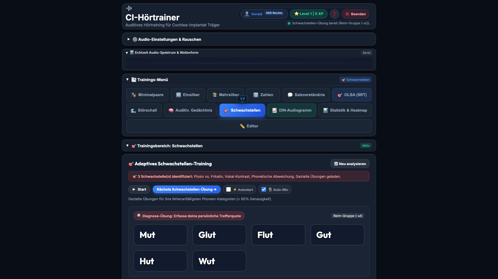

* **Ziel:** Automatisches Fördern der individuellen Fehlerschwerpunkte.
* **Funktionsweise:** Filtert alle Phonem-Kategorien mit einer Trefferquote unter 60 % aus der gesamten Trainingshistorie und stellt dynamische Übungs-Sets mit spezifischen logopädischen Hinweisen zusammen.
* **Voraussetzung:** Mindestens 10 abgeschlossene Trainingseinheiten in anderen Modulen.

---

### Modul 10 – 📈 Freiburger DIN-Audiogramm (<kbd>Alt+A</kbd>)

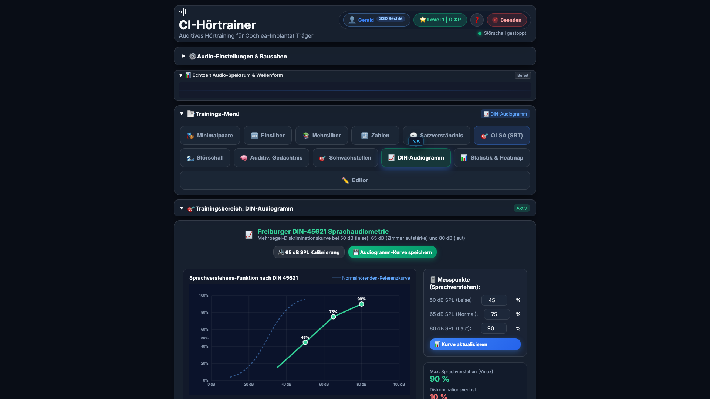

* **Ziel:** Mehrpegel-Sprachaudiometrie bei 50 dB (leise), 65 dB (Zimmerlautstärke) und 80 dB (laut).
* **Auswertung:**
  * Automatischer Vergleich mit der **DIN-45621 Normalhörenden-Referenzkurve**.
  * Berechnung des maximalen Sprachverstehens ($V_{\max}$).
  * Berechnung des **Diskriminationsverlusts** (Abstand zur Normkurve).
* **Visualisierung:** Interaktives Liniendiagramm mit Fehlerbalken und Normkurven-Overlay.

---

### Modul 11 – 📊 Statistik & Phonem-Heatmap (<kbd>Alt+8</kbd>)

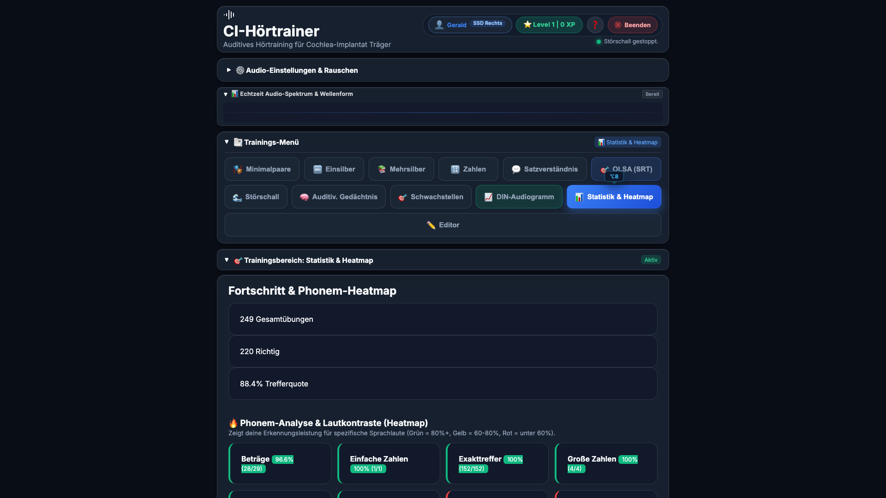

* **Analysen:**
  * **Phonem-Heatmap:** Farb-codierte Erfolgsquote für alle Lautkategorien (Plosive, Frikative, Nasale, Vokale, ...). Rot = Schwachstelle, Grün = sicher beherrscht.
  * **XP-Punkte & Level:** Gamification-Fortschrittsanzeige mit Level-Badge.
  * **Reaktionszeiten:** Durchschnittliche Antwortzeiten pro Kategorie.
  * **Protokolltabelle:** Vollständige, filterbare Übungshistorie mit Datum, Modul, Wort, Ergebnis.
* **Datenverwaltung:** Selektives oder vollständiges Löschen der Trainingshistorie.

---

### Modul 12 – ✏️ Übungs-Editor & Kategoriemanager (<kbd>Alt+9</kbd>)

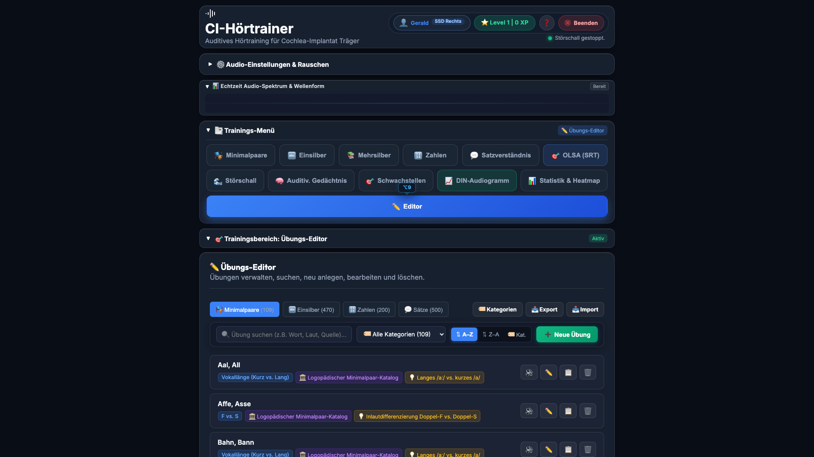

* **Funktionen:**
  * Erstellen, Bearbeiten und Löschen eigener Übungen für alle 4 Kernmodule.
  * **Globaler Kategoriemanager:** Modulübergreifendes Umbenennen und Bereinigen von Kategorien.
  * **Bulk-Import:** Schneller Import ganzer Wortlisten im JSON-Format.
  * **Silbentrennung:** Automatische Silbenanalyse für neue Mehrsilber-Einträge.

---

### 🌐 5.12 Zweisprachiges Hörtraining & Englische Sprachübungen (ESL)

Für CI-Träger, die Englisch als Zweitsprache (ESL) sprechen oder trainieren möchten, bietet der CI-Hörtrainer ein vollständiges englisches Übungs-Ökosystem.

* **Sprachumschaltung:** Mit einem Klick auf `🇬🇧 EN` im App-Header wird die aktive Übungssprache auf Englisch umgestellt. Die Benutzeroberfläche bleibt dabei in vertrautem Deutsch.
* **146 Englische Übungseinheiten (182 Zielwörter/Sätze):**
  * **Minimalpaare (36 Paare / 72 Wörter):** Fokussiert auf Deutsch-Englisch Phonem-Transferschwierigkeiten (`/r/` vs `/l/` in *rake/lake*, `th` `/θ/` vs `/f/`/`/t/` in *think/fink*, `/v/` vs `/w/` in *vine/wine*, `/ɪ/` vs `/iː/` in *ship/sheep*, Stimmhaftigkeit `P/B`, `T/D`, `K/G`, Zischlaute `CH/SH`).
  * **Einsilber (36 Wörter):** Klinische CNC / NU-6 Einsilber (*check, note, park, white, wide, youth, goose, tough, house, rain, moon, star, book, chair, door, light, friend, etc.*).
  * **Spondee-Mehrsilber (30 Wörter):** Zwei-silbige Wörter gleicher Betonung (*cowboy, hotdog, baseball, ice cream, toothbrush, sunshine, rainbow, football, popcorn, airport, etc.*).
  * **Zahlen & Beträge (24 Einheiten):** Englische Zahlen, Uhrzeiten (*2:30 PM, 8:15 AM, 9:45 AM*) und Währungsformate (*$12.50, £4.99, €45.00*).
  * **Sätze (20 Sätze):** Alltagsgespräche, Reise- & Orientierungssätze und englische 5-Wort-Matrixsätze.
* **💡 Tipp / Übersetzung:** Bei englischen Übungen kann per Tipp-Button jederzeit die deutsche Übersetzung eingeblendet werden.
* **Double Metaphone Algorithmus:** Speziell für die englische Phonetik optimierte Lautauswertung und akustisches Feedback.

---

### 📄 5.13 Klinischer Therapeutenbericht (Logopädie- & Audiologie-Export)

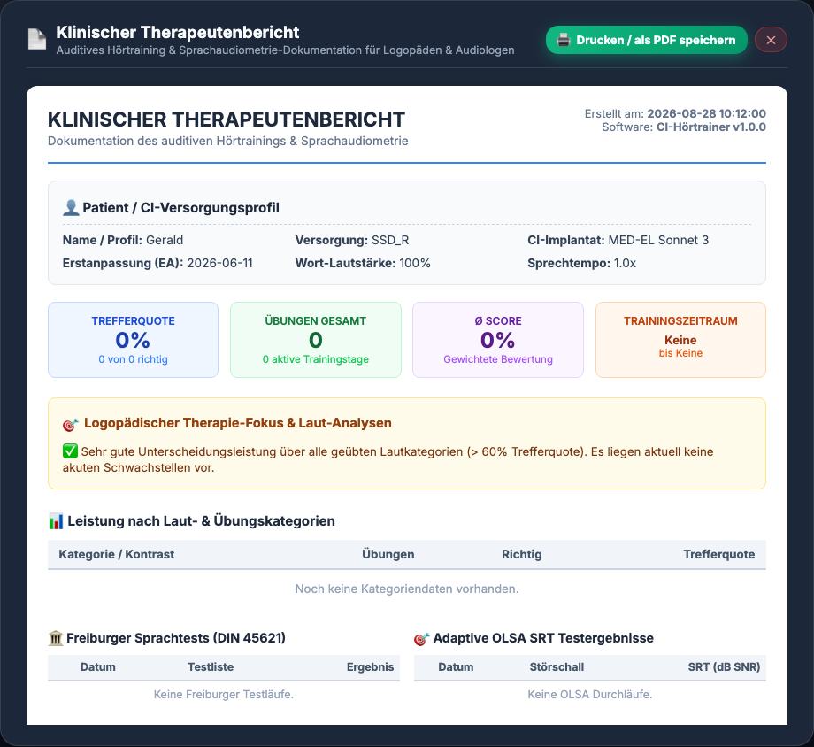

Über den oberen Button **„📄 Bericht“** in der Navigationsleiste öffnest du den **Klinischen Therapeutenbericht**. Dieser aggregiert alle relevanten Daten für Logopäden, Audiologen und HNO-Fachärzte:

* **Patienten- & CI-Versorgungsprofil:** Name, Versorgungstyp (z. B. Bilateral, Monoral, Bimodal, SSD), Implantat-Modell (z. B. Cochlear Nucleus 8, MED-EL Sonnet 3), Erstanpassungsdatum (EA), Wort-Lautstärke und Sprechtempo.
* **Therapie-Zusammenfassung (KPIs):** Gesamtanzahl absolvierter Übungen, globale Trefferquote (%), gewichteter Durchschnittsscore, aktive Trainingstage und erster/letzter Trainingszeitpunkt.
* **Logopädischer Therapie-Fokus:** Automatische Auswertung zur Identifikation von Schwachstellen (z. B. Plosive *P/B*, Frikative *S/SCH*, Vokallängen), die in der nächsten logopädischen Sitzung gezielt geübt werden sollten.
* **Kategorienspezifische Erfolgsquote:** Detaillierte Tabelle nach Lautkontrasten, Einsilbern, Zahlen und Sätzen.
* **Sprachaudiometrie-Historie:** Verlauf der offiziellen Freiburger Einsilbertests (DIN 45621) und OLSA-Matrix-Satztests (SRT in dB SNR).
* **🖨️ Drucken & PDF-Export:** Ein Klick auf *„🖨️ Drucken / als PDF speichern“* verwendet ein optimiertes Druck-Layout (`@media print`), um einen sauberen 1–2-seitigen klinischen Ausdruck oder eine PDF-Datei zur Patientenakte zu erstellen.

---

### 📜 5.14 System Logs & Fehleranalyse

Sollte es bei der Nutzung des Hörtrainers zu Problemen oder Fehlern kommen (z.B. bei der Spracherkennung oder beim Audio-Playback), steht ein integrierter Log-Viewer zur Verfügung.

Über den oberen Button **„📜 Logs“** in der Navigationsleiste öffnest du das System-Logs Modal. 
Dort werden die neuesten Einträge aus der Datei `ci_training.log` angezeigt. Das hilft bei der Fehlerdiagnose enorm, ohne dass du die Logdatei auf deinem Computer suchen musst. Wenn ein Fehler auftritt, kannst du diesen Text einfach kopieren und an den Support oder Entwickler weiterleiten.

---

## ⌨️ 6. Barrierefreie Tastatur-Hotkeys

Die Anwendung lässt sich vollständig und ohne Maus über die Tastatur bedienen:

| Taste / Kürzel | Funktion |
|:---|:---|
| <kbd>Leertaste</kbd> / <kbd>P</kbd> | Aktuelles Audio erneut abspielen / Pause im Countdown |
| <kbd>1</kbd> .. <kbd>6</kbd> / <kbd>Numpad 1..6</kbd> | Option 1 bis 6 auswählen |
| <kbd>Enter</kbd> / <kbd>Numpad Enter</kbd> | Eingabe prüfen / Bestätigen |
| <kbd>N</kbd> / <kbd>→</kbd> | Nächste Übung aufrufen & sofort abspielen |
| <kbd>M</kbd> | Mikrofon-Aufnahme starten (Nachsprechen) |
| <kbd>Alt+P</kbd> / <kbd>⌥P</kbd> / <kbd>U</kbd> | **Profil-Manager** öffnen |
| <kbd>Alt+1</kbd> bis <kbd>Alt+9</kbd> | Direktes Umschalten zwischen den Trainingsmodulen |
| <kbd>Alt+O</kbd> | Direkt zum **OLSA-Matrix-Satztest** wechseln |
| <kbd>Alt+A</kbd> | Direkt zum **Freiburger DIN-Audiogramm** wechseln |
| <kbd>H</kbd> / <kbd>?</kbd> / <kbd>F1</kbd> | **Online-Hilfe & Hotkey-Übersicht** öffnen |
| <kbd>Esc</kbd> | Modals, Hilfefenster oder Fokus schließen |
| <kbd>Q</kbd> | Anwendung & lokalen Server beenden |

---

## 🧪 7. Automatisierte Tests ausführen

Zur Überprüfung aller 12 Module und API-Endpunkte steht die integrierte Testsuite zur Verfügung:

```bash
.venv/bin/python3 -m unittest discover tests
```

---

## 📷 8. Screenshots erneuern

Um alle Screenshots im Handbuch zu aktualisieren, starte die App und führe aus:

```bash
.venv/bin/python3 scripts/capture_screenshots_py.py
```

*(Erfordert Playwright – im Normalbetrieb ohne Internetverbindung mit vorhandenen Screenshots arbeiten.)*

---

## 💡 9. Audiologische Empfehlungen für den Trainingsalltag

1. **Regelmäßigkeit vor Dauer:** Täglich 15 bis 20 Minuten intensives Hörtraining erzielen nachhaltigere Erfolge als seltene, lange Einheiten.
2. **Hörermüdung beachten:** Hören mit dem CI erfordert hohe kognitive Konzentration. Lege bei nachlassender Aufmerksamkeit kurze Pausen ein.
3. **Stufenweises Steigern:**
   * *Phase 1:* Minimalpaare & Freiburger Einsilber in Ruhe (ohne Störschall).
   * *Phase 2:* Mehrsilber, Zahlen, Uhrzeiten und Satzdiktate.
   * *Phase 3:* Störschall mit moderatem Pegel (`+10 dB SNR` → `+5 dB SNR`).
   * *Phase 4:* OLSA-Matrix-Satztest im anspruchsvollen Lärm (`0 dB SNR` / `-5 dB SNR`).
4. **Seitengetrenntes Üben:** Bei bimodaler oder bilateraler Versorgung empfiehlt es sich, das schwächere Ohr gezielt über die Stereo-Kanalbalance (`Links (CI)` oder `Rechts (CI)`) isoliert zu trainieren.
5. **Stimmen variieren:** Übe mit verschiedenen Stimmen (männlich/weiblich, verschiedene Regionen), um im Alltag gegenüber verschiedenen Sprechern sicherer zu werden.
6. **Regionale Akzente trainieren:** Verwende die österreichischen und Schweizer Azure-Stimmen für Toleranz gegenüber regionalen Aussprache-Variationen.
